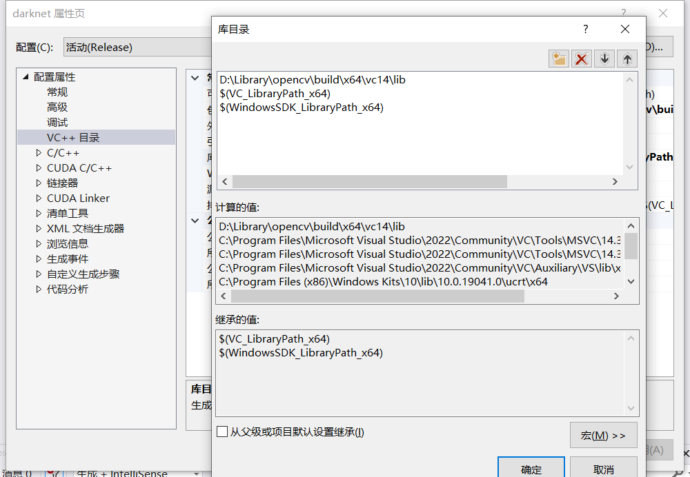

# Yolov4 + COCO2017 训练记录

### 一、环境介绍
+   System      :Windows 10 专业版
+   GPU         :Nvidia GTX3050
+   OpenCV      :[Download 3.4.0](https://udomain.dl.sourceforge.net/project/opencvlibrary/opencv-win/3.4.0/opencv-3.4.0-vc14_vc15.exe)
+   IDE         :Visual Studio 2022
+   Nvidia info :
    +   Driver Version  : [Download](https://www.nvidia.cn/Download/index.aspx?lang=cn)
    +   CUDA Version    : [11.5 Download](https://developer.download.nvidia.com/compute/cuda/11.5.1/local_installers/cuda_11.5.1_496.13_windows.exe)
    +   cudnn Version   : [8.2.2.26 Download](https://developer.nvidia.com/compute/machine-learning/cudnn/secure/8.2.2/11.4_07062021/cudnn-11.4-windows-x64-v8.2.2.26.zip)
+  **注意事项：请先安装VS，随后再安装CUDA**

### 二、配置环境
1.  安装Nvidia驱动
    +   安装完成后在CMD中使用 `nvidia-smi` 即可看到显卡相关信息:  
        

2.  安装CUDA
    1.  安装完成后:
        1.  CMD中使用 `nvcc -V` 即可看到CUDA信息:  
            

        2.  CMD中,在`C:\Program Files\NVIDIA GPU Computing Toolkit\CUDA\v11.5\extras\demo_suite`目录下执行`deviceQuery.exe`可看到如下信息:  
            

3.  安装cudnn
    1.  解压cudnn.zip

    2.  粘贴解压后的 `bin、include、lib` 中的内容分别到 `C:\Program Files\NVIDIA GPU Computing Toolkit\CUDA\v11.5\` 下的 `bin、include、lib` 目录中。

4.  安装Opencv  
    Emmm,干就完事了

5.  配置环境变量
    1.  确定如下环境变量存在：
        

    2.  复制 `C:\Program Files\NVIDIA GPU Computing Toolkit\CUDA\v11.5\extras\visual_studio_integration\MSBuildExtensions\` 目录下全部文件到 `C:\Program Files\Microsoft Visual Studio\2022\Community\Msbuild\Microsoft\VC\v160\BuildCustomizations\` 目录下


### 三、配置项目
1.  [下载 darknet-yolov4](https://github.com/AlexeyAB/darknet/archive/refs/tags/yolov4.zip)

2.  解压到 `$yolov4-project` 目录

3.  进入 `$yolov4-project/build/darknet/` 目录，编辑 `darknet.vcxproj` 文件:全局替换 `CUDA 11.1` 为 `CUDA 11.5`

4.  使用 VS2022 打开 `darknet.sln`
    1.  打开项目后不升级，进入项目属性:  
        属性配置->常规，做如下更改:
        

    2.  修改编译选项:
        
    
    3.  darknet属性页如下配置
        1.  属性配置->VC++目录->包含目录:
            

        2.  属性配置->VC++目录->库目录:
            

        3.  属性配置->连接器->输入->附加依赖项:
            

        4.  属性配置->生成事件->生成后事件->命令行:
            `XCOPY D:\Library\opencv\build\x64\vc14\bin\opencv_ffmpeg340_64.dll $(OutDir) /y`
            `XCOPY D:\Library\opencv\build\x64\vc14\bin\opencv_world340.dll  $(OutDir) /y`
            

5.  构建项目  
    Emmmm,直接生成就完事了铁子,生成成功如下:
    


### 四、准备数据集
1.  下载COCO2017数据集
    +   [Train](http://images.cocodataset.org/zips/train2017.zip)

    +   [Val](http://images.cocodataset.org/zips/val2017.zip)
    
    +   [annotations](http://images.cocodataset.org/annotations/annotations_trainval2017.zip)

2. 转换数据集格式(因为COCO2017是COCO格式，需要转成VOC格式。以下`.../`为你解压的实际目录)
    1.  生成 train2017.txt 及 label文件
        1.  在 `.../coco_dataset/train2017/` 目录下打开cmd执行 `dir /s /b /a > ../train2017.txt` 生成文件目录的绝对路径列表

        2.  使用python脚本 `coco2yolo.py --json_path .../coco_dataset/annotations/instances_train2017.json --save_path .../coco_dataset/train2017/` 

    2.  生成 val2017.txt
        1.  在 `.../coco_dataset/val2017/` 目录下打开cmd执行 `dir /s /b /a > ../val2017.txt` 生成文件目录的绝对路径列表

        2.  使用python脚本 `coco2yolo.py --json_path .../coco_dataset/annotations/instances_val2017.json --save_path .../coco_dataset/val2017/` 
    
    3. coco2yolo.py:
        ```pyhton
        """
        COCO 格式的数据集转化为 YOLO 格式的数据集
        --json_path 输入的json文件路径
        --save_path 保存的文件夹名字，默认为当前目录下的labels。
        """
        
        import os 
        import json
        from tqdm import tqdm
        import argparse
        
        parser = argparse.ArgumentParser()
        parser.add_argument('--json_path', default='./instances_val2017.json',type=str, help="input: coco format(json)")
        parser.add_argument('--save_path', default='./labels', type=str, help="specify where to save the output dir of labels")
        arg = parser.parse_args()
        
        def convert(size, box):
            dw = 1. / (size[0])
            dh = 1. / (size[1])
            x = box[0] + box[2] / 2.0
            y = box[1] + box[3] / 2.0
            w = box[2]
            h = box[3]
        
            x = x * dw
            w = w * dw
            y = y * dh
            h = h * dh
            return (x, y, w, h)
        
        if __name__ == '__main__':
            json_file =   arg.json_path # COCO Object Instance 类型的标注
            ana_txt_save_path = arg.save_path  # 保存的路径
        
            data = json.load(open(json_file, 'r'))
            if not os.path.exists(ana_txt_save_path):
                os.makedirs(ana_txt_save_path)
            
            id_map = {} # coco数据集的id不连续！重新映射一下再输出！
            with open(os.path.join(ana_txt_save_path, 'classes.txt'), 'w') as f:
                # 写入classes.txt
                for i, category in enumerate(data['categories']): 
                    f.write(f"{category['name']}\n") 
                    id_map[category['id']] = i
            # print(id_map)
        
            anns = {}
            for ann in data['annotations']:
                imgid = ann['image_id']
                anns.setdefault(imgid, []).append(ann)
        
            print('got anns')
        
            for img in tqdm(data['images']):
                filename = img["file_name"]
                img_width = img["width"]
                img_height = img["height"]
                img_id = img["id"]
                head, tail = os.path.splitext(filename)
                ana_txt_name = head + ".txt"  # 对应的txt名字，与jpg一致
                f_txt = open(os.path.join(ana_txt_save_path, ana_txt_name), 'w')
        
                ann_img = anns.get(img_id, [])
                for ann in ann_img:
                    box = convert((img_width, img_height), ann["bbox"])
                    f_txt.write("%s %s %s %s %s\n" % (id_map[ann["category_id"]], box[0], box[1], box[2], box[3]))
                f_txt.close()
        ```


### 五、修改训练配置文件
1.  修改 `$yolov4-project/build/darknet/build/darknet/x64/data/coco.data` 为
    ```text
    classes= 80
    train  = H:\dataset\coco2017\tarin2017.txt
    valid  = H:\dataset\coco2017\val2017.txt
    names = H:\dataset\coco2017\coco.names
    backup = H:\dataset\coco2017\backup\
    eval=coco
    ```
    (请讲目录替换为你自己的目录，"coco.names"在`$yolov4-project/build/darknet/build/darknet/x64/cfg/`即存在)

2.  修改 `$yolov4-project/build/darknet/build/darknet/x64/cfg/coco.data` 中
    ```shell
    batch=32
    subdivisions=32
    #这里的batch和subdivisions表示一次性加载64张图片到内存，分8次完成前向传播，每次8张
    #经过64张图片的前向传播后，完成一次反向传播及更新
    width=320
    height=320
    ```

3. 下载 [预训练模型 yolov4.conv.137](https://github.com/AlexeyAB/darknet/releases/download/darknet_yolo_v3_optimal/yolov4.conv.137) [权重文件 yolov4.weights](https://github.com/AlexeyAB/darknet/releases/download/darknet_yolo_v3_optimal/yolov4.weights) 到 `$yolov4-project/build/darknet/build/darknet/x64/` 目录

### 六、启动训练
+   在 ``目录下进入cmd，输入命令
    ```shell
    ./darknet.exe detector train data/coco.data cfg/yolov4.cfg ./yolov4.conv.137 -map
    ```
    开始训练

### 七、推理测试
+   在 ``目录下进入cmd，输入命令
    ```shell
    ./darknet detector demo data/coco.data cfg/yolov4.cfg yolov4.weights data/自行下载的视频.mp4
    ```
    开始推理测试
    
